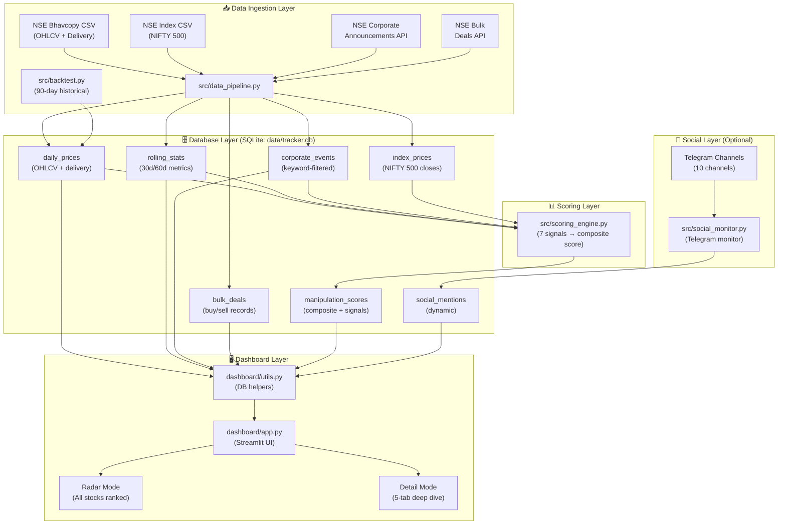

# 🕵️ Daily Manipulation Tracker

<div align="center">

[](https://www.python.org/)
[](LICENSE)
[](https://github.com/yieldchaser/Daily-Manipulation-Tracker/actions)
[](https://www.sqlite.org/)
[](https://streamlit.io/)

**A Python-based surveillance system for detecting potential stock price manipulation on India's National Stock Exchange (NSE).**

*Targeting small/micro-cap equities outside Nifty 50 and Nifty Next 50 — where pump-and-dump schemes are feasible.*

</div>

---

> 💡 **Core Philosophy:** *"Has something suspicious been happening consistently for weeks? A stock that grinds up 0.5–2% EVERY SINGLE DAY for 30–60 days with no news and low delivery = manipulation."*

---

## 📋 Table of Contents

- [Project Overview](#-project-overview)
- [Tech Stack](#-tech-stack)
- [Architecture](#-architecture)
- [The 7 Manipulation Signals](#-the-7-manipulation-signals)
- [Phase Classification](#-phase-classification)
- [Noise Filter](#-noise-filter)
- [Dashboard Features](#-dashboard-features)
- [Data Sources](#-data-sources)
- [Installation & Usage](#-installation--usage)
- [Environment Variables](#-environment-variables)
- [Project Structure](#-project-structure)
- [CI/CD](#-cicd)
- [Known Limitations](#-known-limitations)
- [Contributing](#-contributing)
- [License](#-license)
- [Disclaimer](#-disclaimer)

---

## 🔍 Project Overview

**Daily Manipulation Tracker** is a Python-based surveillance system designed to detect potential stock price manipulation on India's **National Stock Exchange (NSE)**. It specifically targets **small and micro-cap NSE equities** — those outside the Nifty 50 and Nifty Next 50 indices — where coordinated pump-and-dump schemes are most feasible due to lower liquidity and market depth.

The system ingests daily NSE bhavcopy data, computes 7 quantitative manipulation signals per stock, assigns a composite score, and presents findings through an interactive Streamlit dashboard. Stocks exhibiting suspicious patterns — such as abnormally consistent price gains, chronically low delivery percentages, or sudden volume spikes — are flagged and ranked for review.

---

## 🛠️ Tech Stack

| Layer | Technology | Version |
|---|---|---|
| Language | Python | 3.11+ |
| Database | SQLite 3 | stdlib |
| Dashboard | Streamlit | ≥ 1.32.0 |
| Charts | Plotly | ≥ 5.19.0 |
| Data wrangling | Pandas | ≥ 2.0.0 |
| Numerics | NumPy | ≥ 1.24.0 |
| HTTP client | Requests | ≥ 2.31.0 |
| HTML parsing | BeautifulSoup4 | ≥ 4.12.0 |
| Timezone handling | pytz | ≥ 2023.3 |
| Date utilities | python-dateutil | ≥ 2.8.2 |
| NSE data library | jugaad-data | 0.27 (backtest only) |
| Telegram client | telethon | ≥ 1.34.0 (optional) |

---

## 🏗️ Architecture

The system is organised into **4 distinct layers**: data ingestion, database storage, scoring, and visualisation.



### Layer Details

#### 📥 Data Ingestion Layer
- **[`src/data_pipeline.py`](src/data_pipeline.py)** — Daily runner that downloads NSE bhavcopy (OHLCV + delivery data), normalises columns, upserts into `daily_prices`, computes rolling stats, and fetches corporate announcements and bulk deals from NSE JSON APIs. Uses cookie-based session authentication and exponential backoff retry logic (3 attempts, 2ⁿ second delays).
- **[`src/backtest.py`](src/backtest.py)** — Standalone 90-day historical validation tool using `jugaad-data`.

#### 🗄️ Database Layer (`data/tracker.db`)

6 tables are maintained:

| Table | Description |
|---|---|
| `daily_prices` | OHLCV + delivery per stock per day (`symbol`, `date`, `open/high/low/close`, `total_volume`, `delivery_volume`, `delivery_pct`, `pct_change`) |
| `rolling_stats` | Pre-computed rolling metrics (`avg_volume_30d`, `vol_ratio`, `price_change_30d/60d`, `upper_circuit_streak`, `week_52_high/low`) |
| `corporate_events` | Keyword-filtered NSE announcements (`event_type`, `description`, `source`) |
| `bulk_deals` | NSE bulk/block deal records (`client_name`, `buy_sell`, `quantity`, `price`) |
| `manipulation_scores` | Daily composite scores (`total_score`, `signal_1–signal_7`, `phase`, `signals_triggered`) |
| `index_prices` | NIFTY 500 benchmark closes (`index_name`, `date`, `close`) |
| `social_mentions` | Created dynamically by [`src/social_monitor.py`](src/social_monitor.py) |

#### 📊 Scoring Layer
- **[`src/scoring_engine.py`](src/scoring_engine.py)** — Reads 120 days of history, applies the noise filter, computes all 7 signals per stock, and writes composite scores to `manipulation_scores`.

#### 🖥️ Dashboard Layer
- **[`dashboard/app.py`](dashboard/app.py)** — Streamlit interactive UI with Radar and Detail modes.
- **[`dashboard/utils.py`](dashboard/utils.py)** — Database helper functions for querying and formatting data.

---

## 📡 The 7 Manipulation Signals

The scoring engine evaluates each stock against 7 quantitative signals. The **maximum possible composite score is 12.5**, which is normalised to a **0–10 scale** in the dashboard.

| Signal | Name | Max Score | Logic |
|---|---|:---:|---|
| **S1** | 🔊 Abnormal Volume Consistency | 2.0 | >40% of last 30 days had volume >2× the 90-day average |
| **S2** | 📦 Chronic Low Delivery | 2.0 | 8–15+ up-days in 30 days where delivery% < 25% |
| **S3** | 📈 Steady Grind | 2.0 | >70–80% positive days in 45 days AND std dev of returns < 1–1.5% |
| **S4** | 🚀 Price Detachment | 1.5 | Stock up >40–80% more than NIFTY 500 over 60 days |
| **S5** | 🎯 Velocity Fingerprint | 1.5 | 60-day return >50–100% AND smoothness (% up-days) >75–80% |
| **S6** | 🔬 Micro-Cap Detachment | 1.5 | Avg daily turnover <₹5Cr AND 60-day price move >50% |
| **S7** | ⚠️ Reversal Risk | 2.0 | 2–3 of: price declining last 5d, delivery spiking on down days, volume suddenly dropped |

> **Note:** S7 currently always scores 0 due to the NSE Bulk Deals API returning HTTP 404 as of early 2026. See [Known Limitations](#-known-limitations).

---

## 🚦 Phase Classification

Stocks are classified into one of five phases based on their composite score:

| Score Range | Phase | Meaning |
|:---:|---|---|
| 0 – 3 | 🟢 **CLEAN** | No unusual pattern detected |
| 3 – 5 | 🟡 **WATCH** | Unusual pattern developing — monitor closely |
| 5 – 7 | 🟠 **PUMP PHASE** | Active accumulation or pumping likely underway |
| 6 – 8 + S7 firing | 🔴 **DISTRIBUTION** | Operators likely exiting — high reversal risk |
| 8+ | ⛔ **EXTREME** | Textbook manipulation pattern — extreme caution |

---

## 🔇 Noise Filter

Before scoring, stocks are **automatically skipped** if any of the following conditions are met:

1. 🏦 Symbol is in the **Nifty 50 or Nifty Next 50** (~102 symbols hardcoded in [`src/scoring_engine.py`](src/scoring_engine.py))
2. 📰 Had a **quarterly results or dividend announcement** in the last 5 trading days
3. 💧 **90-day average daily turnover > ₹100 crore** (too liquid to manipulate)
4. 📉 **Fewer than 60 days** of price history in the database

This filter ensures the system focuses exclusively on the small/micro-cap universe where manipulation is feasible.

---

## 🖥️ Dashboard Features

Launch the dashboard with `streamlit run dashboard/app.py` and navigate to `http://localhost:8501`.

### 📡 Radar Mode
The default landing view — all stocks ranked by manipulation score for the most recent trading date.

- 📊 **Summary metrics**: counts of Extreme / Distribution / Pump / Clean stocks
- 🔽 **Filterable** by minimum score threshold and phase
- 🔍 **Per-row "View" button** navigates directly to Detail mode for that stock

### 🔬 Detail Mode — 5 Tabs

| Tab | Name | Contents |
|:---:|---|---|
| 1 | 📈 Price & Volume | Plotly candlestick (OHLC) + colour-coded volume bars + delivery volume overlay |
| 2 | 🎯 Manipulation Scores | Score timeline with green/yellow/red risk zones + per-signal breakdown chart + signals triggered log |
| 3 | 📊 Rolling Stats | Volume metrics (30d avg, vol ratio), price change (30d/60d), 52-week range, upper circuit streak bar chart |
| 4 | 📰 Events & Deals | Corporate events table + event type pie chart; bulk deals table + buy/sell bar chart; combined timeline |
| 5 | 📡 Social Monitoring | Telegram mention count chart per platform/channel |

---

## 🌐 Data Sources

| Data Source | URL Pattern | Status |
|---|---|:---:|
| NSE Full Bhavcopy CSV | `nsearchives.nseindia.com/products/content/sec_bhavdata_full_{DDMMYYYY}.csv` | ✅ Working |
| NSE CM Bhavcopy CSV (fallback) | `nsearchives.nseindia.com/content/cm/BhavCopy_{DDMMMYYYY}_1.csv` | ✅ Working |
| NSE Index Bhavcopy CSV | `nsearchives.nseindia.com/content/indices/ind_close_all_{DDMMYYYY}.csv` | ✅ Working |
| NSE Corporate Announcements API | `nseindia.com/api/corporate-announcements` | ✅ Working |
| NSE Bulk Deals API | `nseindia.com/api/bulk-deal-archives` | ❌ HTTP 404 (as of early 2026) |

> **Authentication:** NSE requires cookie-based session authentication. The pipeline hits the NSE homepage first to obtain valid session cookies before making any data requests. All HTTP requests use **exponential backoff retry logic** (3 attempts, 2ⁿ second delays).

---

## 🚀 Installation & Usage

### Prerequisites

- Python **3.11+**
- Internet access to NSE archives (`nseindia.com`, `nsearchives.nseindia.com`)

### Installation

```bash
git clone https://github.com/yieldchaser/Daily-Manipulation-Tracker.git
cd Daily-Manipulation-Tracker
pip install -r requirements.txt
python src/create_db.py
```

### Daily Operation

Run the following three steps in order each trading day:

```bash
# Step 1: Ingest today's NSE data
python src/data_pipeline.py

# Optional: specify a specific date
python src/data_pipeline.py --date 2024-01-15
```

```bash
# Step 2: Compute manipulation scores
python src/scoring_engine.py

# Optional: specify a specific date
python src/scoring_engine.py --date 2024-01-15
```

```bash
# Step 3: Launch the interactive dashboard
streamlit run dashboard/app.py
# Opens at http://localhost:8501
```

### Historical Backtest

Run a 90-day historical validation against known manipulation cases (`RMDRIP`, `SILVERLINE`, `BGDL`):

```bash
python src/backtest.py
# Downloads 90 days of data for RMDRIP, SILVERLINE, BGDL
# Prints score timeline and goal verification summary
```

> **Note:** `jugaad-data==0.27` is required for backtest. It is listed in `requirements.txt` but used only by this script.

### Social Monitor (Optional)

The Telegram social monitor is an **optional** component excluded from `requirements.txt` for cloud deployment compatibility.

```bash
# Step 1: Install telethon separately
pip install telethon>=1.34.0

# Step 2: Set required environment variables
export TELEGRAM_API_ID=<your_api_id>
export TELEGRAM_API_HASH=<your_api_hash>
export TELEGRAM_PHONE=<your_phone_with_country_code>

# Step 3: Run the monitor
python src/social_monitor.py
```

Obtain your `TELEGRAM_API_ID` and `TELEGRAM_API_HASH` from [https://my.telegram.org](https://my.telegram.org).

---

## 🔐 Environment Variables

| Variable | Required | Description |
|---|:---:|---|
| `TELEGRAM_API_ID` | Social monitor only | Integer API ID from [my.telegram.org](https://my.telegram.org) |
| `TELEGRAM_API_HASH` | Social monitor only | String API hash from [my.telegram.org](https://my.telegram.org) |
| `TELEGRAM_PHONE` | Social monitor only | Phone number with country code (e.g. `+919876543210`) |

> No `.env` file is required for core functionality. The database path (`data/tracker.db`) is resolved automatically relative to each script's location.

---

## 📁 Project Structure

```
Daily-Manipulation-Tracker/
├── .github/                    # GitHub Actions CI workflow
├── dashboard/
│   ├── app.py                  # Streamlit dashboard (Radar + Detail modes)
│   └── utils.py                # Database helper functions
├── data/
│   └── tracker.db              # SQLite database (auto-created by create_db.py)
├── src/
│   ├── backtest.py             # 90-day historical validation tool
│   ├── create_db.py            # Database schema initialisation
│   ├── data_pipeline.py        # Daily NSE data ingestion
│   ├── scoring_engine.py       # 7-signal manipulation scoring engine
│   └── social_monitor.py       # Telegram channel monitor (optional)
├── .gitignore
├── LICENSE
├── README.md
└── requirements.txt
```

---

## ⚙️ CI/CD

A **GitHub Actions** workflow runs automatically on every push to `main`:

1. ✅ Checks out the repository
2. ✅ Sets up Python 3.11
3. ✅ Installs all dependencies from `requirements.txt`
4. ✅ Runs `python src/create_db.py` to verify the database schema initialises without error

The workflow configuration is located in [`.github/`](.github/).

---

## ⚠️ Known Limitations

| Limitation | Impact |
|---|---|
| **NSE Bulk Deals API returns HTTP 404** (as of early 2026) | Signal S7 (Reversal Risk) always scores 0; composite scores may be understated by up to **1.0 point** |
| `telethon` excluded from `requirements.txt` | Must be installed manually (`pip install telethon>=1.34.0`) to use the social monitor |
| `jugaad-data` is a soft dependency | Only required for `src/backtest.py`; not needed for daily operation |
| Nifty 50 / Nifty Next 50 exclusion list (~102 symbols) is **hardcoded** | Requires manual update in [`src/scoring_engine.py`](src/scoring_engine.py) when index compositions change |
| Telegram channels list (10 channels) is **hardcoded** | Requires manual update in [`src/social_monitor.py`](src/social_monitor.py) to add/remove channels |

---

## 🤝 Contributing

Contributions are welcome! Here's how to get started:

1. **Fork** the repository on GitHub
2. **Clone** your fork locally:
   ```bash
   git clone https://github.com/<your-username>/Daily-Manipulation-Tracker.git
   cd Daily-Manipulation-Tracker
   ```
3. **Create a feature branch**:
   ```bash
   git checkout -b feature/your-feature-name
   ```
4. **Make your changes** and ensure the CI check passes:
   ```bash
   pip install -r requirements.txt
   python src/create_db.py
   ```
5. **Commit** with a clear, descriptive message:
   ```bash
   git commit -m "feat: add Signal S8 for circuit breaker pattern detection"
   ```
6. **Push** to your fork and open a **Pull Request** against `main`

### Areas for Contribution

- 🔧 Fix or replace the broken NSE Bulk Deals API integration
- 📊 Add new manipulation signals (e.g., circuit breaker patterns, FII/DII divergence)
- 🌐 Add support for BSE (Bombay Stock Exchange) data
- 🤖 Automate the daily pipeline via cron or GitHub Actions scheduled workflow
- 📱 Add email or WhatsApp alert notifications for high-score stocks
- 🧪 Write unit tests for the scoring engine

---

## 📄 License

This project is licensed under the **MIT License** — see the [LICENSE](LICENSE) file for details.

---

## ⚖️ Disclaimer

> **This tool is for educational and research purposes only.**
>
> It does not constitute financial advice, investment recommendations, or any form of regulated financial service. The manipulation signals are **heuristic in nature** and may produce false positives or false negatives. Past patterns of suspicious activity do not guarantee future price movements.
>
> **Always conduct your own due diligence before making any investment decisions.** The authors and contributors of this project accept no liability for any financial losses incurred as a result of using this tool.

---

<div align="center">

Made with ❤️ for the Indian retail investor community

⭐ Star this repo if you find it useful!

</div>
